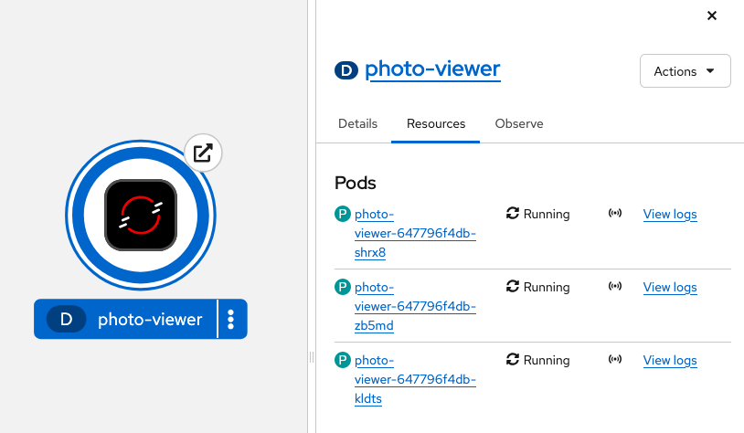
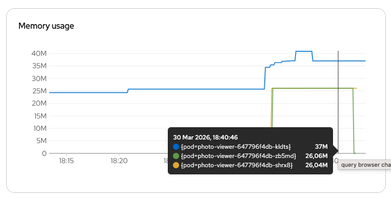
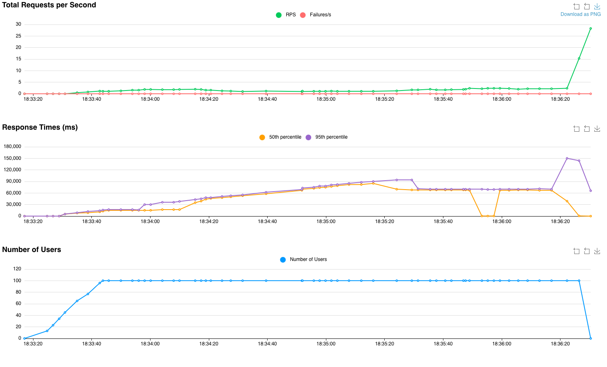

# Load testing

In this, I'll go through the steps to add load balanicng to the application. I'm also going to include the results of the testing.

## The base
For load testing, I'm using `locust`.

In the [`load-testing`](load-testing) folder, there are 3 files. A [`Dockerfile`](load-testing/Dockerfile) for creating the image, a [`locust-deployment.yaml`](load-testing/locust-deployment.yaml) which contains the required resources and the [`locustfile.py`](load-testing/locust-deployment.yaml) which `locust` uses.

### The new resource

The [`locust-deployment.yaml`](load-testing/locust-deployment.yaml) contains 3 resources, a deployment for the locust master, one for the worker, and a service allowing connectivity.

The worker deployment contains 3 pods for allowing larger load testing.

The above mentioned setup can be seen in the topology view:

### Simulating user actions
For simulating user action, each locust simulated user registers and logs in, then with 50-50 chance they get a specific picture, requiring IO operation, or request information about all the pictures.

### Modifying the resource limits

In order to better see the scaling behavior I modified the resource requests and limits for the `photo-viewer` app for the following:
- CPU:
  - request: 100m
  - limit: 200m
- Memory
  - request: 128Mi
  - limit: 256Mi

## Reaching the locust UI

To be able to reach the locust UI, we have to expose the service, more specifically the 8089 port. In OpenShift, we can do this by creating a new Route.

## Testing the application with 100 users
On the locust UI we can parameterize how many users we want, and in what rate should they spawn. For this I've used 100 users, with a 5 users/second spawn rate. The host is given in the manifest itself, but we can also supply it here if we want to.

### Following the changes in OpenShift

Initially we can see that only one pod is running:

After starting the load testing, we can see that after a while, our pod count increased to 3.

After the load is no longer present, the deployment automatically scales back down to only one pod:

The increase and decrease in pod count can be better observed on the Metrics tab at the `photo-viewer` deployment. We can see the new pods spawning as the load hits the threshold.

### Metrics from locust

On the locust UI we can gather information about `Total Requests per Second`, `Response Times` and the `Number of Users`.

We can also see the statistics of the requests.

Type | Name | # Requests | # Fails | Median (ms) | 95%ile (ms) | 99%ile (ms) | Average (ms) | Min (ms) | Max (ms) | Average size (bytes) | Current RPS | Current Failures/s
-----|------|------------|---------|-------------|-------------|-------------|--------------|----------|----------|----------------------|-------------|------------------- |
GET | /api/photo [GET all] | 248 | 0 | 310 | 144000 | 154000 | 22870.57 | 3 | 155001 | 2508 | 18.4 | 0
GET | /api/photo/2 [GET] | 223 | 0 | 9 | 700 | 1000 | 156.49 | 3 | 2183 | 160 | 9.1 | 0
POST | /auth/login | 100 | 0 | 68000 | 70000 | 71000 | 56793.85 | 7105 | 71102 | 76.62 | 0.8 | 0
POST | /auth/register | 100 | 0 | 56000 | 90000 | 94000 | 53027.33 | 4741 | 94338 | 2 | 0 | 0
|| Aggregated | 671 | 0 | 530 | 82000 | 150000 | 24871.71 | 3 | 155001 | 991.84 | 28.3 | 0

The requests contain processing heavy tasks, like authorization (`/auth` requests) and IO heavy tasks (retrieving a singular photo `/api/photo/2`) and also the most common request, getting the information of all the photos (`/api/photo`)