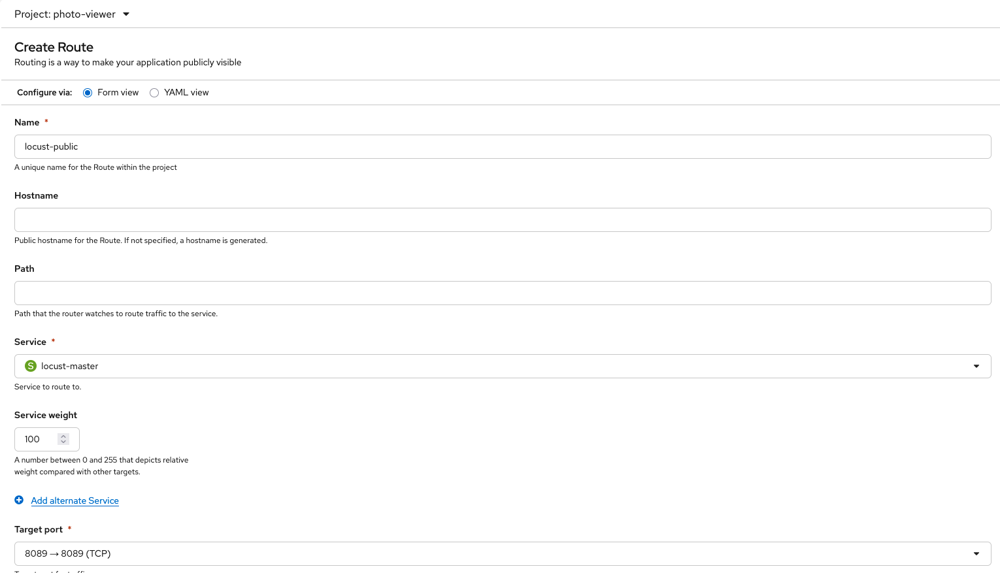
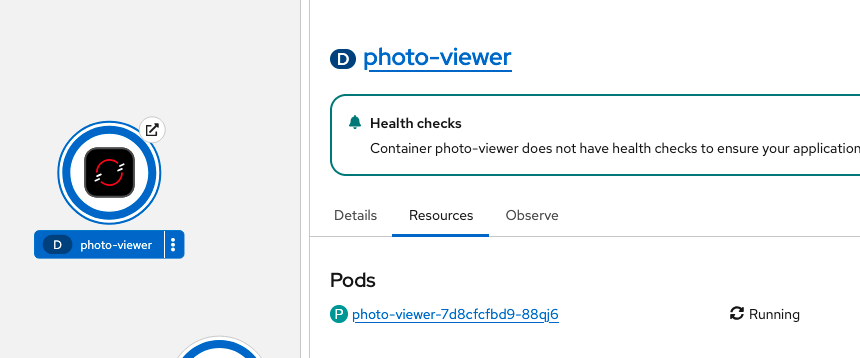

# Load testing

In this, I'll go through the steps to add load balanicng to the application. I'm also going to include the results of the testing.

## The base
For load testing, I'm using `locust`.

In the [`load-testing`](load-testing) folder, there are 3 files. A [`Dockerfile`](load-testing/Dockerfile) for creating the image, a [`locust-deployment.yaml`](load-testing/locust-deployment.yaml) which contains the required resources and the [`locustfile.py`](load-testing/locust-deployment.yaml) which `locust` uses.

### Load testing API

For simulating user action, each locust simulated user registers and logs in, then with 50-50 chance they get a picture, or request all the pictures.

### Modifying the resource limits

In order to better see the scaling behavior I modified the resource requests and limits for the `photo-viewer` app for the following:
- CPU:
  - request: 100m
  - limit: 200m
- Memory
  - request: 128Mi
  - limit: 256Mi

## Reaching the locust UI

To be able to reach the locust UI, we have to expose the service, more specifically the 8089 port. In OpenShift, we can do this by creating a new Route.

## The testing

Initially we can see that only one pod is running:
