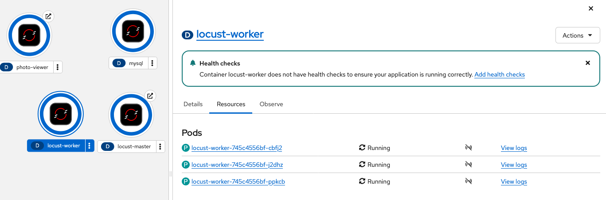
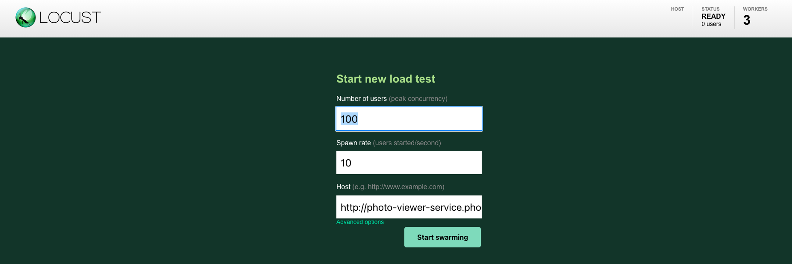
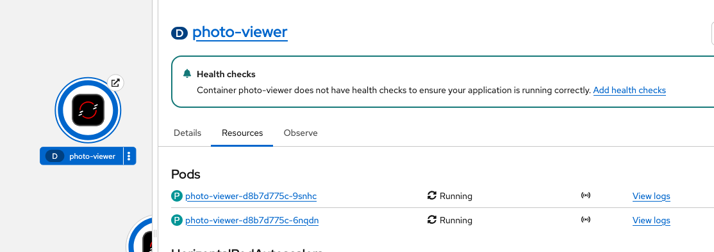
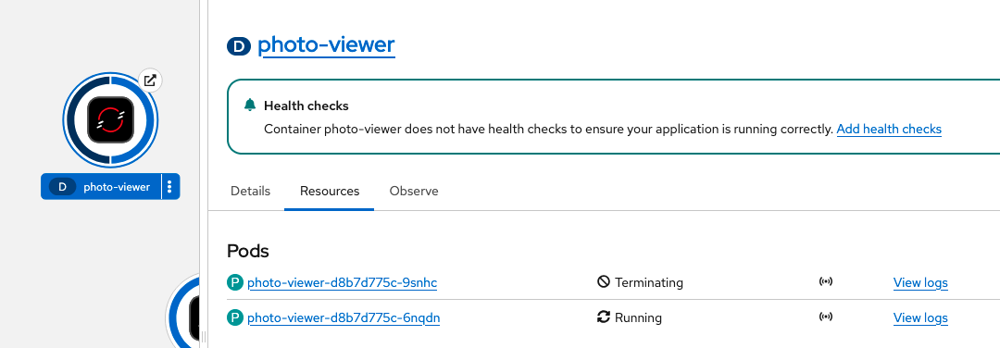

# Load testing

In this, I'll go through the steps to add load balanicng to the application. I'm also going to include the results of the testing.

## The base
For load testing, I'm using `locust`.

In the [`load-testing`](load-testing) folder, there are 3 files. A [`Dockerfile`](load-testing/Dockerfile) for creating the image, a [`locust-deployment.yaml`](load-testing/locust-deployment.yaml) which contains the required resources and the [`locustfile.py`](load-testing/locust-deployment.yaml) which `locust` uses.

### The new resource

The [`locust-deployment.yaml`](load-testing/locust-deployment.yaml) contains 3 resources, a deployment for the locust master, one for the worker, and a service allowing connectivity.

The worker deployment contains 3 pods for allowing larger load testing.

The above mentioned setup can be seen in the topology view:

### Simulating user actions
For simulating user action, each locust simulated user registers and logs in, then with 50-50 chance they get a specific picture, requiring IO operation, or request information about all the pictures.

### Modifying the resource limits

In order to better see the scaling behavior I modified the resource requests and limits for the `photo-viewer` app for the following:
- CPU:
  - request: 100m
  - limit: 200m
- Memory
  - request: 128Mi
  - limit: 256Mi

## Reaching the locust UI

To be able to reach the locust UI, we have to expose the service, more specifically the 8089 port. In OpenShift, we can do this by creating a new Route.

## The testing

Initially we can see that only one pod is running:

On the locust UI we can parameterize how many users we want, and in what rate should they spawn. For this I've used 100 users, with a 10 user/second spawn rate. The host is given in the manifest itself, but we can also supply it here if we want to.

With this setup, we can see in the topology view, that the pod count increased in the response of the load:

After the load is no longer present, the deployment automatically scales back down to only one pod:

We can see the pod terminating here
